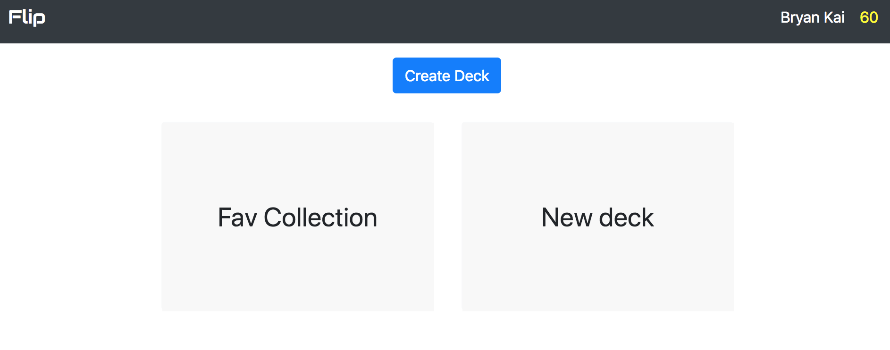
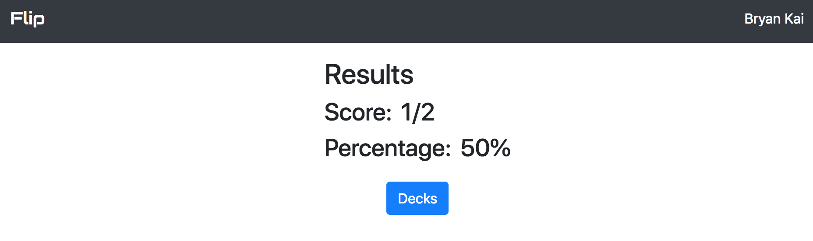

# Flip
http://flip-flashcard-app.surge.sh/

An interactive flashcard web application to help users memorize information.  Users can create decks to organize groups of cards by topic or any grouping you want.  You can take a quiz on different decks and get the results for the latest quiz session.  The user's total score is stored in the database and displayed next to their name in the header on the dashboard page.

Dashboard

Quiz Results

### Future Work
* Connect to an external Bible API to import verse when creating new cards

### Technologies
* HTML/CSS
* Bootstrap - CSS Framework
* axios - AJAX requests
* Express.js
* Node.js
* Knex.js
* PostgreSQL
